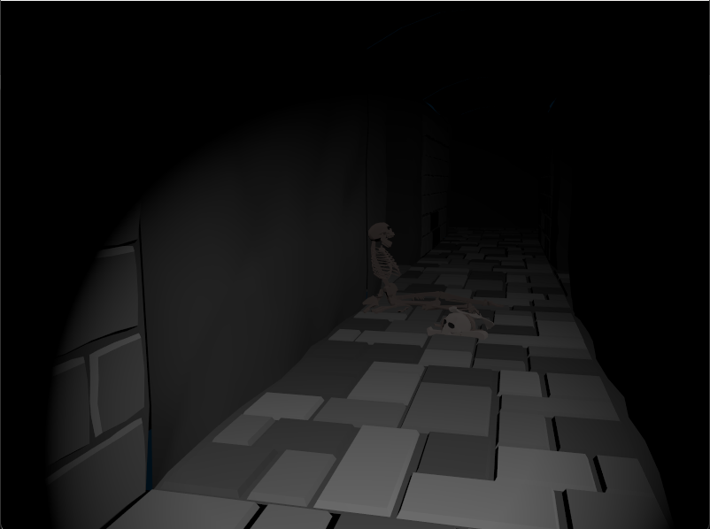

# Computer Graphics final project

This is the final project for the course Computer Graphics held by Politecnico di Milano during my Computer Science and Engineering Master degree in 2023.

# Game description

The game is structured as a dungeon crawler were the player must explore four different rooms in search of prismatic gems.

Each room has a different shader with multiple light settings to showcase the concepts learned during the course.

The basic assets were provided by the course staff and each room was then created in blender.

Some images from the game are shown below.

  
  
  
  

