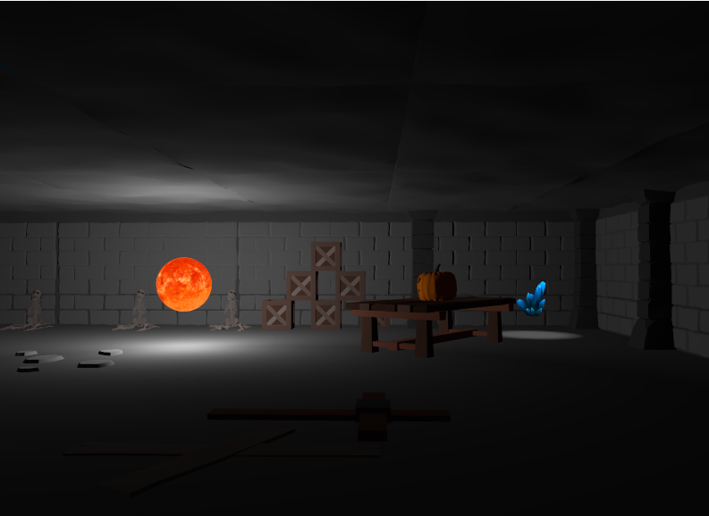

# 🎲 Computer Graphics - Project 
This is the repository for the projects of Computer Graphics course held at [Polimi](https://www.polimi.it/).

The course held on 3 main topics:
* Basic 3D graphics
* [Vulkan API](https://www.vulkan.org/)
* Shaders and real-time rendering

The coverage of these topics was done through the development of 16 assignment and a final project to put in practice all the knowledge acquired. 

🛠️ All the projects were developed in C++ with a [Visual Studio](https://visualstudio.microsoft.com/) solution. To set up the environment,  [Vulkan SDK](https://vulkan.lunarg.com/) and [GLFW](https://www.glfw.org/) are needed. Tutorial on how to set up the environment can be found [here](https://vulkan-tutorial.com/Development_environment). 

--- 
### ⏰ Assignment
In the relative folder all the 16 assignments are present. Each assignment is a Visual Studio solution with the source code and the relative PDF file with the specification. Most of the assignments implies the implementation of a specific algorithm or the use of a specific technique is a single, designed file.

Some good results of the assignments are shown below.

---
### 🎮 Final Project

The final project is a game developed mixing all the knowledge acquired during the course. The game is a "Dungeon Crawler" and it is a 3D game with four differently shaded rooms that the player is free to explore. The assets were provided by the course staff or created using blender and are present in the relative [folder](DungeonCrawler/CGFP/CGFP/models).

---
✔️ Final Evaluation: 30/30
