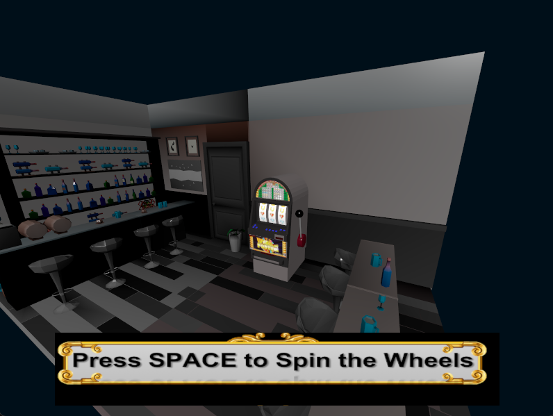
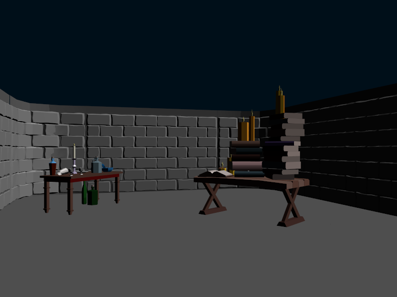

# 🎲 Computer Graphics - Projects

Welcome to the repository showcasing the projects developed for the **Computer Graphics** course at [Politecnico di Milano (Polimi)](https://www.polimi.it/).

## Course Overview

The course covered three main topics:
- **Basic 3D Graphics**
- **[Vulkan API](https://www.vulkan.org/)**
- **Shaders and Real-Time Rendering**

These topics were explored through 16 assignments and a final project, designed to apply and consolidate the knowledge gained throughout the course.

🛠️ **Development Environment:**  
All projects were developed in **C++** using a **[Visual Studio](https://visualstudio.microsoft.com/)** solution. To set up the environment, the following tools are required:  
- [Vulkan SDK](https://vulkan.lunarg.com/)  
- [GLFW](https://www.glfw.org/)  

For setup instructions, refer to the [Vulkan Tutorial](https://vulkan-tutorial.com/Development_environment).  

---

## ⏰ Assignments

The repository includes all 16 assignments, each available in its respective folder. Every assignment contains:
- A Visual Studio solution with the source code.
- A PDF specification detailing the requirements.

Assignments typically involve implementing a specific algorithm or technique in a dedicated file.

### Results Showcase

Below are some examples of the outcomes achieved in the assignments:

    
    
    
    

---

## 🎮 Final Project: Dungeon Crawler Game

The final project is a **3D Dungeon Crawler game**, combining all the techniques and knowledge acquired during the course. The game features:
- Four uniquely shaded rooms.
- A simple physics and collision engine.
- A fully explorable 3D environment.

### Assets  
The assets for the game were either provided by the course staff or created using **Blender**. All models and assets are located in the [models folder](DungeonCrawler/CGFP/CGFP/models).

    
    
    
    

---
## ✔️ Final Evaluation: **30/30**
